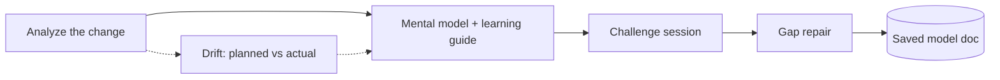

# 🧠 Brainload

> **AI writes the code. Brainload writes it into your brain.**

A [Claude Code](https://claude.com/claude-code) skill that turns AI-generated changes
into a mental model you actually hold: an architecture map, a calibrated learning
guide, and an adaptive challenge session that finds — and repairs — the gaps in your
understanding.

## The problem

AI coding agents implement faster than you can read.

```
AI implementation speed
        ↓
hundreds to thousands of changed lines
        ↓
read all of it line-by-line?   →  the speed you gained is gone
accept it because tests pass?  →  you now own a system you can't explain
```

Keep accepting green diffs, and one day it's *your* project whose behavior you can't
predict, whose design you can't defend, and whose bugs you can't localize. People
call this *cognitive debt* or *comprehension debt* — but it isn't really debt. It's
simpler and worse: **the system exists, and its model doesn't exist in your head.**
(More on this in [docs/philosophy.md](docs/philosophy.md).)

Code review tools already answer *"is this code correct?"*
Brainload answers a different question: **"do you know how this system works?"**

## What it does

Point it at any scope of change:

```
/brainload                      # what changed in this session
/brainload HEAD~3..HEAD         # a commit range
/brainload 41d3c2a              # a single commit
/brainload #142                 # a pull request
/brainload "the auth feature"   # natural language
```



### 1. A mental model, not a diff summary

Not *"17 files changed, +1,328 lines"* but the reconstructed meaning: components and
what flows between them (with **new vs modified** marked), the key concepts and *why
each exists*, and the invariants — what must always hold, where it's enforced, and
what breaks otherwise.

### 2. A learning guide, calibrated to you

- **Guided reading tour** — the ~20% of the change worth reading line-by-line, in
  the right order, with what to notice at each stop. The rest gets an honest
  one-line dismissal.
- **Key flows** — sequence diagrams for the happy path *and* the most instructive
  failure path.
- **Design decisions** — what alternative wasn't taken, and why.
- **Prerequisite refreshers** for juniors (JWT structure, Redis TTLs, …) — only for
  the things you don't already know.

### 3. A challenge session — where the model actually gets built

Six question types — each one interrogates a different section of the mental model:

| Type | Question it asks | Verifies that you… |
|---|---|---|
| **MAP** | "Where does X happen?" | can navigate it |
| **FLOW** | "Walk me through what happens when…" | hold the causal chain |
| **SIMULATE** | "What happens if…?" | can run the model forward |
| **WHY** | "Why this way? What breaks otherwise?" | understand the intent |
| **EXTEND** | "How would you extend it to…?" | have a model that generalizes |
| **DIAGNOSE** | "Given symptom S, where do you look first?" | can operate it |

One question at a time. Free-form answers — never multiple choice. Adaptive
difficulty. Honest grading (`solid / shaky / missing / confident-wrong`). Wrong
answers are the point: each one locates a real gap, which gets repaired with an
explanation anchored to actual `file:line`s.

### 4. Drift — planned vs actual (the fun one)

Capture your intended architecture *before* the AI builds (`/brainload-plan`), and
Brainload opens with the only diff that matters:

```
PLANNED                          ACTUAL

API → AuthService → DB           API → AuthService → TokenCache → DB
                                                        ↑
                                                       NEW
```

Instead of reading thousands of lines, you start from *"what differs from the model
already in my head?"* — and the challenge questions concentrate exactly there.

## Quick look

```
> /brainload

Scope: 4 commits, 17 files, +1,328 −204 — JWT auth with Redis sessions.

[system map]

Key concepts: access/refresh separation · token rotation ·
Redis TTL as session authority · auth middleware boundary

Invariants:
  1. Refresh TTL (7d) > access TTL (15m)      session.service.ts:41
  2. Logout deletes the Redis session          auth.service.ts:88
  3. A rotated refresh token is single-use     session.service.ts:63

Reading tour (~260 of 1,328 lines):
  1. auth.middleware.ts:12-48 — the boundary every request crosses
  2. session.service.ts:30-90 — rotation & reuse detection
  ...

Ready? Say "challenge me".

> challenge me

Q1/7 · FLOW · login flow
From POST /login to a refresh token sitting in Redis: which
components does the request pass through, in order, and what
does each one add?
```

A full example of the generated model doc — challenge log included — is in
[examples/auth-feature-model.md](examples/auth-feature-model.md).

## Install

**As a plugin** (recommended):

```
/plugin marketplace add devTabasco/brainload
/plugin install brainload@brainload
```

**As a project skill** (share with your team via the repo):

```bash
git clone https://github.com/devTabasco/brainload
cp -r brainload/skills/* your-project/.claude/skills/
```

**As a personal skill** (available in every project):

```bash
cp -r brainload/skills/* ~/.claude/skills/
```

## Usage

```
/brainload [scope] [flags]

  scope    (empty) session · <sha> · <a>..<b> · #PR · "described feature"
  flags    --quick            shorter guide, 3–5 questions
           --deep             everything, 10–15 questions
           --map-only         guide only, no challenge
           --challenge-only   reuse a saved model, go straight to questions

/brainload-plan [feature]     capture the intended model before implementation
```

Typical loop:

1. `/brainload-plan payment-retry` — sketch the intent *(optional, enables drift)*
2. Let the AI implement; verify correctness with tests / review as usual
3. `/brainload` — build the mental model, take the challenge
4. Days later: `/brainload --challenge-only payment-retry` — re-check what was shaky

## Output

Model docs persist so understanding accumulates instead of evaporating:

```
.brainload/
├── config.md                        # persistence preference (asked once)
├── planned/
│   └── payment-retry.md             # baselines from /brainload-plan
└── models/
    └── 2026-08-11-payment-retry.md  # guide + challenge log, updated on re-runs
```

Commit them (they double as onboarding docs), gitignore them (personal notes), or
choose chat-only — asked once per repo.

## What Brainload is not

- **Not a code reviewer.** Correctness is upstream — keep your tests, types, and
  review process. Brainload assumes the code works and asks whether *you* work.
- **Not a documentation generator.** The doc is a by-product. The deliverable is a
  developer who can predict, explain, extend, and debug the system without
  rereading the diff.
- **Not a quiz toy.** No multiple choice, no trivia. It is a mental-model
  interrogation with honest grading — and it tells you what it found, even when
  that's uncomfortable.

Also works for **onboarding**: run it on a teammate's PR to install their change
into your head before you review or build on it.

## Roadmap

- **Review mode** — spaced re-challenges that target previously shaky concepts
- **Hook integration** — offer a brainload session automatically after large diffs
- **Team mode** — shared model docs as living onboarding material

## License

[MIT](LICENSE)
