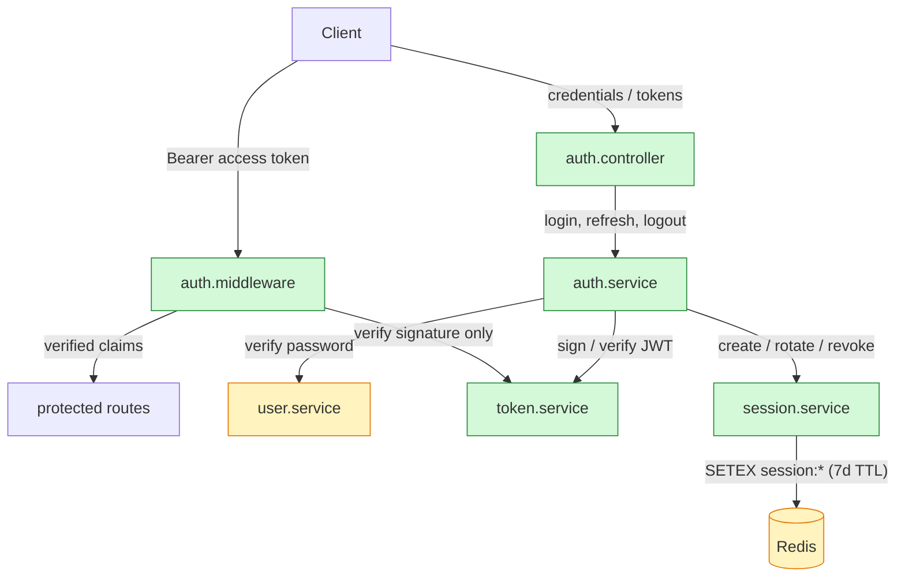
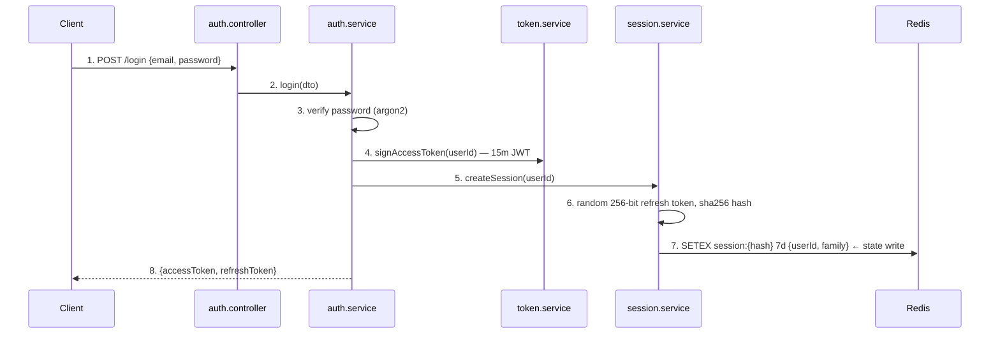
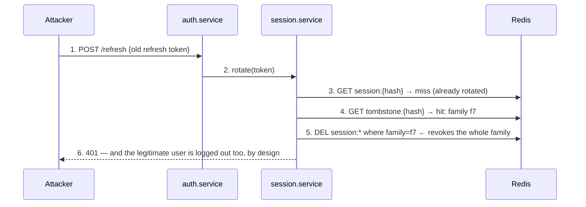

<!-- This is an example of the document /brainload produces, for a fictional but
     realistic change: JWT authentication with Redis-backed sessions added to a
     Node/TypeScript API. The challenge log at the bottom shows what a completed
     session records. -->

---
scope: 4 commits (a1f0c2e..41d3c2a), 17 files, +1,328 −204
date: 2026-08-11
calibration: knows the area, not this change; has not used Redis in production
status: challenged
---

# JWT auth with Redis sessions — mental model

## The system in three sentences

Every request crosses `authMiddleware`, which verifies a short-lived JWT access
token **statelessly** — no store is consulted. Long-lived sessions live only in
Redis as opaque refresh tokens with a TTL, and `SessionService` rotates the refresh
token on every use, treating a reused old token as theft. The crux: logout and
expiry are Redis-side facts, so anything that bypasses Redis (like a still-valid
access token) keeps working until it expires on its own.

## System map



Legend: green = new in this change · amber = modified · plain = pre-existing context

## Key flows

### Login — happy path



### Refresh with a stolen (already-rotated) token — failure path



## Key concepts

| Concept | What it is | Why it exists here | Where |
|---|---|---|---|
| Access/refresh separation | 15m stateless JWT + 7d stateful opaque token | Stateless verification keeps every request off Redis; statefulness is reserved for the rare refresh call, where revocability matters | `token.service.ts:18`, `session.service.ts:24` |
| Token rotation | Every refresh invalidates the used token and issues a new one | Makes a stolen refresh token single-use — reuse becomes a detectable event instead of a silent 7-day compromise | `session.service.ts:52-78` |
| Token families | Each login starts a family id; rotations inherit it | On reuse detection, the whole family can be revoked — one theft signal kills every descendant token | `session.service.ts:61,74` |
| Hash-at-rest | Redis stores sha256(token), never the token | A Redis dump or rogue read can't mint valid refresh calls | `session.service.ts:57` |
| Redis TTL as session authority | Session lifetime = key TTL; logout = `DEL` | No cron, no cleanup job, no "expired" column — expiry is the store's native behavior | `session.service.ts:66`, `auth.service.ts:88` |
| Middleware boundary | One middleware verifies the JWT signature and expiry, nothing else | Exactly one place decides "who is this request" — and it deliberately never touches Redis | `auth.middleware.ts:12-48` |

## Invariants

| # | Invariant | Enforced at | If broken |
|---|---|---|---|
| 1 | Refresh TTL (7d) > access TTL (15m) | `config/auth.ts:9-11` — startup assert | Sessions die before access tokens; users get logged out mid-use, refresh becomes pointless |
| 2 | Logout deletes the Redis session | `auth.service.ts:88` | Refresh works after logout → sessions are immortal |
| 3 | A rotated refresh token is single-use | `session.service.ts:63` — atomic GETDEL | Replayed refresh tokens mint sessions forever; theft is undetectable |
| 4 | Access tokens are never stored server-side | assumed, not enforced — fragile | Someone "helpfully" adds a token table and re-couples every request to storage |

## Design decisions

| Decision | Alternative not taken | Why this one | Revisit when |
|---|---|---|---|
| Opaque refresh tokens in Redis | Stateless JWT refresh tokens | Refresh tokens must be revocable (logout, theft response); stateless tokens can't be recalled | Multi-region, if Redis latency hurts |
| No access-token blocklist | Check a revocation list per request | Keeps requests store-free; accepted cost: ≤15m of validity after logout | Compliance demands instant revocation |
| Family-wide revocation on reuse | Revoke only the reused token | The reused token proves theft; every descendant is suspect | reason not evident from code — flagged for WHY |
| `GETDEL` for rotation | GET then DEL | Atomicity: two concurrent refreshes can't both succeed | Redis cluster mode changes atomicity assumptions |

## Failure modes & edge cases

| Scenario | Behavior | Tested? |
|---|---|---|
| Redis down, request with valid access token | Unaffected — middleware never touches Redis | yes (`auth.e2e.test.ts:141`) |
| Redis down, refresh attempt | 503 from `session.service.ts:47` — fail closed, no silent re-login | no ⚠ |
| Refresh exactly at TTL expiry | Key already evicted → treated as invalid token, 401 | yes |
| Two tabs refresh simultaneously | One wins `GETDEL`; the loser gets 401 and must re-login — known papercut | yes (`session.service.test.ts:88`) |
| Clock skew between API instances | JWT `exp` verified per-instance; >30s skew rejects valid tokens | no ⚠ |

## Guided reading tour — ~260 of 1,328 lines

1. `src/auth/auth.middleware.ts:12-48` — the boundary every request crosses —
   *notice:* Redis is never imported here — *hold:* what does that make impossible?
2. `src/auth/session.service.ts:30-90` — rotation, families, reuse detection —
   *notice:* the `GETDEL` on line 63 and the tombstone write on 74 — *hold:* why is
   atomicity load-bearing here?
3. `src/auth/auth.service.ts:70-95` — login/logout orchestration — *notice:* logout
   is one `DEL`, nothing token-side.
4. `src/config/auth.ts:1-20` — TTLs and the startup assert — *notice:* invariant 1
   lives here, not in the services.
5. `test/session.service.test.ts:60-110` — the accepted spec for rotation edge
   cases.

The remaining ~1,070 lines are wiring and boilerplate: route registration, DTOs,
error classes, Redis client config, and test scaffolding.

## Prerequisites

**Redis TTL (`SETEX` / `GETDEL`).** Redis can attach a lifetime to a key at write
time (`SETEX key seconds value`); the key vanishes on expiry with no cleanup code.
`GETDEL` reads and deletes atomically — no other client can read the key in
between. This change uses TTL as the *only* session-expiry mechanism
(`session.service.ts:66`) and `GETDEL` as the rotation lock (`:63`).

## Self-check

1. Trace `POST /login` to a refresh token existing in Redis — which component adds
   what?
2. Redis goes down: which requests keep working, and for how long?
3. Why can't logout invalidate an access token?
4. Two tabs refresh at once — what happens and why is that acceptable?
5. Where would "log out of all devices" go, and what would it need?

## Challenge log — 2026-08-11

7 questions · calibration: knows the area, not this change

| Concept | Status | Note |
|---|---|---|
| Login flow (FLOW) | solid | Full chain, unprompted, including the hash-at-rest step |
| Token rotation (SIMULATE) | solid | Correctly predicted family revocation on reuse |
| Middleware boundary (MAP) | solid | — |
| Redis-down refresh (SIMULATE) | shaky | Said "it probably retries" — needed rung-2 anchor to `session.service.ts:47`; it fails closed with 503 |
| Logout semantics (DIAGNOSE) | **confident-wrong** | Asserted logout kills access tokens immediately, fluently and incorrectly |
| Family revocation rationale (WHY) | solid | Supplied the missing "reason not evident" — matches OAuth reuse-detection guidance |
| Multi-device logout (EXTEND) | unverified | Session ended early |

**Your mental model — reconstructed from the answers**

```
                    JWT auth + Redis sessions
                              │
          ┌───────────────────┴───────────────────┐
          ▼                                       ▼
   Access token (15m JWT)                 Refresh token (opaque, Redis)
        🟢 solid                                🟢 solid
          │                                       │
   Middleware boundary                       Token rotation
        🟢 solid                                🟢 solid
          │                                       │
   Logout semantics                     Reuse → family revocation
        🔴 misconception                        🟢 solid
   "logout immediately kills                      │
    the access token"                      Redis-down refresh
                                                🟡 shaky
```

```
Login flow                ██████████  solid
Middleware boundary       ██████████  solid
Rotation & families       ██████████  solid
Redis-down behavior       ██████░░░░  shaky
Logout semantics          ██░░░░░░░░  misconception → corrected below
Multi-device logout       ░░░░░░░░░░  unverified
```

Strongest in the token lifecycle; the gap cluster is failure behavior (Redis-down,
logout aftermath) — exactly the store-free-middleware consequences.

**Repairs**

- **Logout semantics** — logout is `DEL session:{hash}` (`auth.service.ts:88`);
  the access token is stateless and lives its full ≤15m (`auth.middleware.ts:31`
  checks signature and `exp` only). The ten-minute "bug report" in Q5 is this
  design's documented tradeoff, not a bug. Lock-in variant answered correctly.
- **Redis-down refresh** — fail-closed 503 at `session.service.ts:47`; untested ⚠,
  flagged as a good first test to add.

**Next:** `/brainload --challenge-only jwt-auth` in a few days — starts with
logout semantics and Redis-down behavior, then the unverified EXTEND question.
